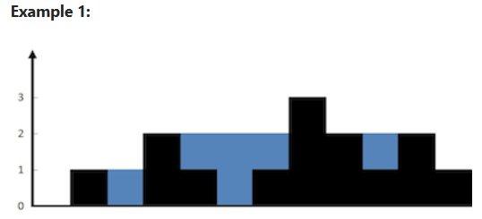

# Trapping Rain Water

## Problem Statement
You are given `n` non-negative integers representing an elevation map where the width of each bar is `1`. Compute how much water it can trap after raining.

## Example 1:

### **Input:**
```plaintext
height = [0,1,0,2,1,0,1,3,2,1,2,1]
```


### **Output:**
```plaintext
6
```

### **Explanation:**
The above elevation map (black section) is represented by the array `[0,1,0,2,1,0,1,3,2,1,2,1]`. In this case, `6` units of rainwater (blue section) are being trapped.

## Example 2:

### **Input:**
```plaintext
height = [4,2,0,3,2,5]
```

### **Output:**
```plaintext
9
```

## Constraints:
- `n == height.length`
- `1 <= n <= 2 * 10^4`
- `0 <= height[i] <= 10^5`